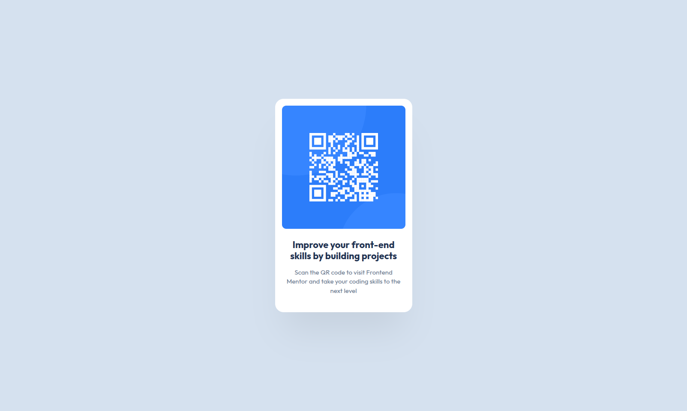

# Frontend Mentor - QR code component solution

This is a solution to the [QR code component challenge on Frontend Mentor](https://www.frontendmentor.io/challenges/qr-code-component-iux_sIO_H). Frontend Mentor challenges help you improve your coding skills by building realistic projects. 

## Table of contents

- [Overview](#overview)
  - [Screenshot](#screenshot)
  - [Links](#links)
- [My process](#my-process)
  - [Built with](#built-with)
  - [What I learned](#what-i-learned)
  - [Continued development](#continued-development)
  - [Useful resources](#useful-resources)
- [Author](#author)
- [Acknowledgments](#acknowledgments)


## Overview

### Screenshot




### Links

- Solution URL: [Frontend Mentor Solution](https://your-solution-url.com)
- Live Site URL: [Live Site at Github](https://your-live-site-url.com)

## My process

### Built with

- Semantic HTML5 markup
- CSS Flexbox
- Box shadow for subtle effects

**Note: These are just examples. Delete this note and replace the list above with your own choices**

### What I learned

To use semantic HTML5 markup with main and article balise

```html
<main>
    
    <article class="card">
      <div class="img-qr-code">
        
      </div>
      <h1 class="card-title">Improve your front-end skills by building projects</h1>
      <p class="card-description">Scan the QR code to visit Frontend Mentor and take your coding skills to the next level</p>
    </article>
</main>
```


## Author

- Github - [Noan-abidostricot](https://github.com/Noan-abidostricot)
- Frontend Mentor - [@Noan-abidostricot](https://www.frontendmentor.io/profile/Noan-abidostricot)

